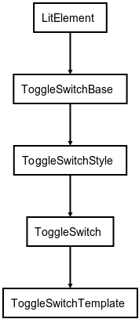

# webcomponent-sample-toggle
Sample WebComponent used for Medium article

This repository contain a WebComponent made with LitElement.
This branch contain the third version of this component, with:
- style
- logic
- events
- template

Splitted in 4 different files, taking advantage of inheritance using the following schema:

